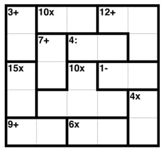

# Sumdoku

Solve the Sumdoku following the rules:
- you are given a grid NxN:
	- fill in the grid with all numbers from 1 to N in each row and column;
	- no repetitions are allowed on rows and columns;
- cells are grouped in regions, represented by a lowercase letter:
	- for each region, in the input file is defined a result and an operation: you have to fill in the cells in each region so that the operation between all cells in region produces the given result;
	- operations allowed:
		- "+": sum all cells in the region to get the provided result;
		- "*": multiply all cells in the region to get the provided result;
		- "-": subtract the max number minus the min number to get the provided result (size is limited to 2 cells);
		- "/": divide the max number to the min number to get the provided result (size is limited to 2 cells).

The solved grid, read by rows, gives you the password for the zip on next level.

## Challenge example

INPUT:

a b b c c
a d e e c
f d g h h
f g g g i
j j k k i

a 3 +
b 10 *
c 12 +
d 7 +
e 4 /
f 15 *
g 10 *
h 1 -
i 4 *
j 9 +
k 6 *

The solved grid is:

1 2 5 4 3
2 3 4 1 5
5 4 1 3 2
3 1 2 5 4
4 5 3 2 1

SOLUTION: 1254323415541323125445321
 
### IMPORTANT!
Some tools have issues when extracting encrypted zip archives, saying the password is invalid. For unzipping archives we strongly recommend using 7zip.
